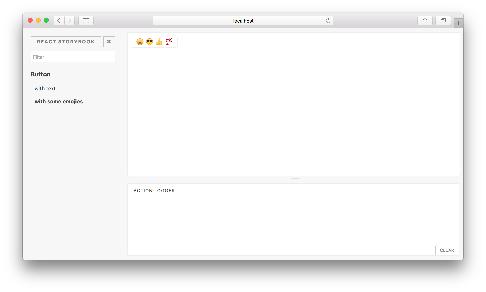

# Component Warehouse

***

Component Warehouse is based on storybook.
This is a platform that lets you practice building React components.

## Getting Started

#### before you run this project, you need install some tools

1. nodejs  [https://nodejs.org/en/](https://nodejs.org/en/)
2. yarn
```
npm install -g yarn
```

#### Start building a development environment

clone & build

```sh
git clone https://github.com/felix2015GitHub/ComponentWarehouse.git
cd ComponentWarehouse
yarn
```
run

```sh
yarn run storybook
```

you can access [http://localhost:9009/](http://localhost:9009)




